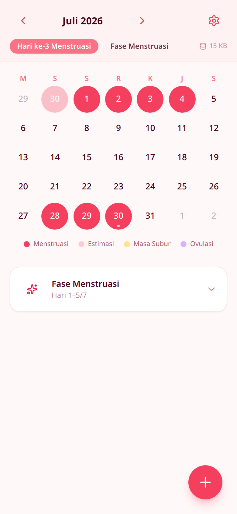
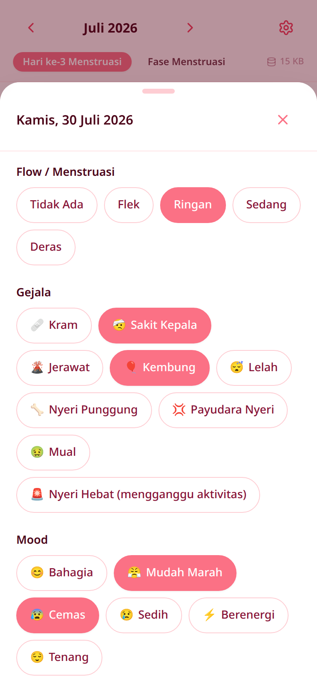
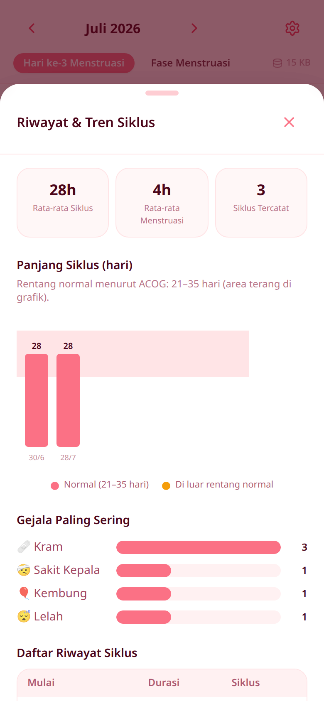
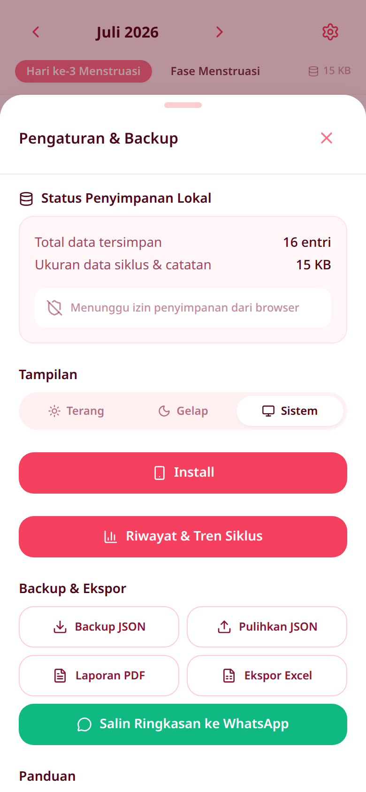

# Mekar Ayu

Pelacak siklus menstruasi yang privat dan 100% berjalan di perangkat pengguna. Tanpa akun, tanpa server, tanpa pelacakan — seluruh data tersimpan secara lokal di browser.

**Live:** https://mekar-ayu.vercel.app/

## Preview

<table>
  <tr>
    <td align="center" width="25%">
      <br />
      <sub><b>Kalender & Status Siklus</b></sub>
    </td>
    <td align="center" width="25%">
      <br />
      <sub><b>Catat Harian</b></sub>
    </td>
    <td align="center" width="25%">
      <br />
      <sub><b>Riwayat & Tren</b></sub>
    </td>
    <td align="center" width="25%">
      <br />
      <sub><b>Pengaturan & Backup</b></sub>
    </td>
  </tr>
</table>

## Fitur

- Kalender siklus dengan prediksi fase (menstruasi, subur, ovulasi, dll.)
- Pencatatan harian: intensitas flow, gejala, mood, dan catatan
- Ringkasan analitik siklus (rata-rata panjang siklus, status saat ini)
- Red flag banner untuk pola yang perlu diperhatikan
- Ekspor data ke PDF/Excel
- Mode gelap/terang
- Progressive Web App (PWA) — dapat diinstal dan dipakai offline
- Penyimpanan 100% lokal menggunakan IndexedDB (Dexie) — tidak ada backend atau telemetry

## Tech Stack

- [React](https://react.dev/) + [TypeScript](https://www.typescriptlang.org/)
- [Vite](https://vite.dev/)
- [Tailwind CSS](https://tailwindcss.com/)
- [Dexie](https://dexie.org/) (IndexedDB) untuk penyimpanan lokal
- [vite-plugin-pwa](https://vite-pwa-org.netlify.app/) untuk dukungan PWA
- `jspdf` / `xlsx` untuk ekspor data

## Menjalankan Secara Lokal

```bash
npm install
npm run dev
```

Perintah lain yang tersedia:

```bash
npm run build    # type-check + build production
npm run lint      # jalankan ESLint
npm run preview   # preview hasil build production
```

## Deploy dengan Docker

Proyek ini menyertakan `Dockerfile` (build multi-stage dengan Nginx) dan `docker-compose.yml`:

```bash
docker compose up --build
```

Aplikasi akan tersedia di `http://localhost:8080`.

## Struktur Proyek

```
src/
├── components/   # Komponen UI (kalender, sheets, header, dll.)
├── data/         # Data statis (fase siklus)
├── db/           # Skema database Dexie/IndexedDB
├── hooks/        # Custom React hooks (analytics, sync status, tema, dll.)
├── lib/          # Logika inti (perhitungan siklus, ekspor, dll.)
└── App.tsx       # Entry point aplikasi
```
