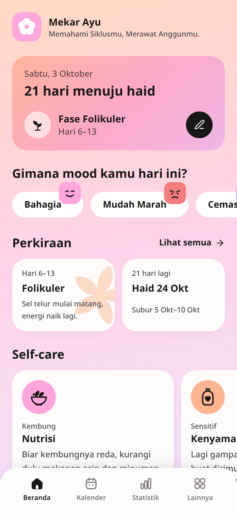
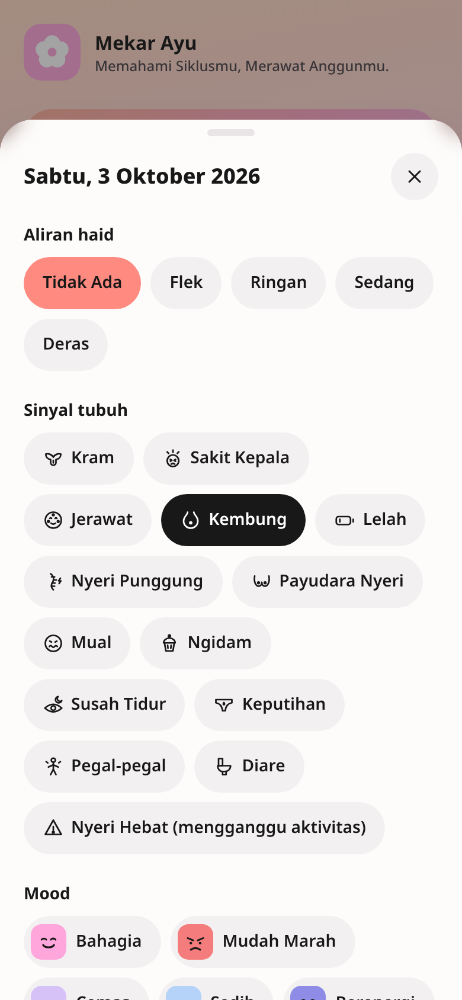
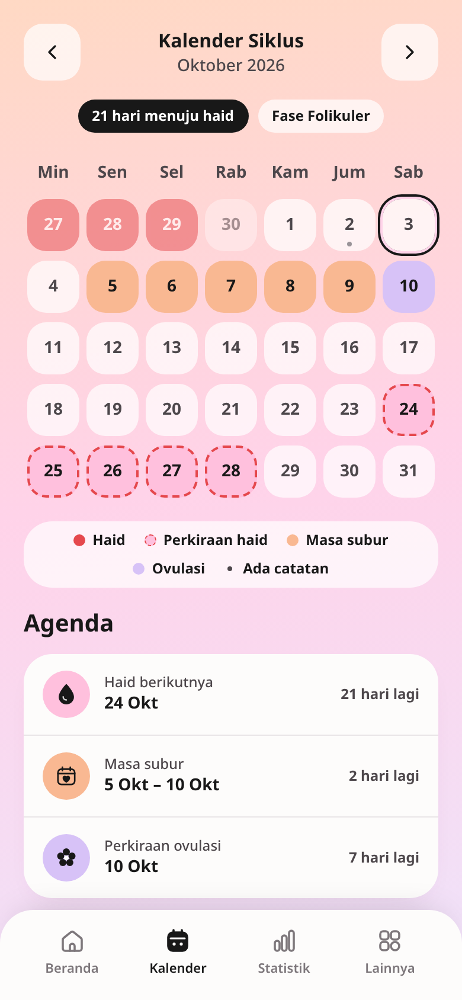
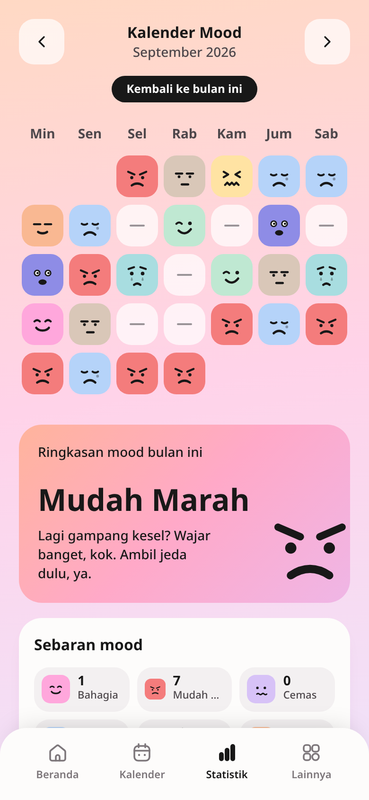
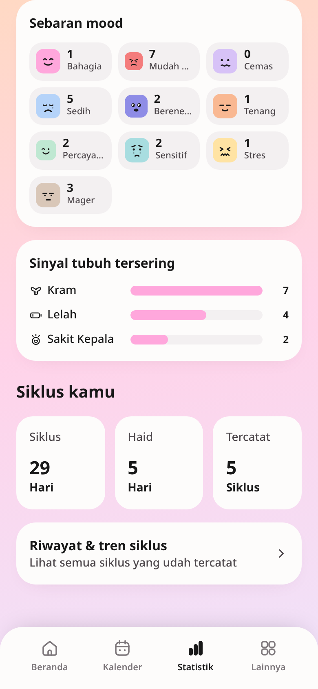
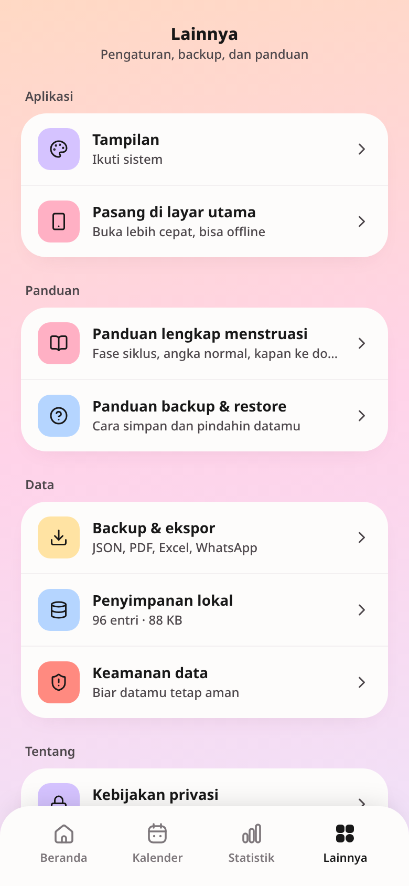

# Mekar Ayu

Pelacak siklus menstruasi yang privat dan 100% berjalan di perangkat pengguna. Tanpa akun, tanpa server, tanpa pelacakan. Seluruh data tersimpan secara lokal di browser.

**Live:** https://mekar-ayu.vercel.app/

## Halaman Utama

Navigasi bawah berisi empat tab: Beranda, Kalender, Statistik, dan Lainnya. Tangkapan layar di bawah memakai data demo (lihat [Data Demo](#data-demo)).

<table>
  <tr>
    <td align="center" valign="top" width="33%">
      <br />
      <b>Beranda</b><br />
      <sub>Ringkasan hari ini: hitung mundur menuju haid, fase siklus yang sedang berjalan, pilihan mood cepat, perkiraan haid dan masa subur, serta tips self-care sesuai fase dan gejala.</sub>
    </td>
    <td align="center" valign="top" width="33%">
      <br />
      <b>Catat Harian</b><br />
      <sub>Sheet pencatatan untuk satu tanggal: aliran haid, sinyal tubuh (gejala), mood, dan catatan bebas. Tersimpan otomatis ke perangkat.</sub>
    </td>
    <td align="center" valign="top" width="33%">
      <br />
      <b>Kalender</b><br />
      <sub>Kalender siklus per bulan dengan penanda haid, perkiraan haid, masa subur, dan ovulasi, plus agenda tanggal penting berikutnya. Ketuk tanggal untuk mencatat.</sub>
    </td>
  </tr>
  <tr>
    <td align="center" valign="top" width="33%">
      <br />
      <b>Statistik: Mood</b><br />
      <sub>Kalender mood per bulan, ringkasan mood yang paling dominan, dan sebaran tiap mood.</sub>
    </td>
    <td align="center" valign="top" width="33%">
      <br />
      <b>Statistik: Siklus</b><br />
      <sub>Gejala yang paling sering muncul, rata-rata panjang siklus dan lama haid, serta pintu masuk ke riwayat dan tren siklus.</sub>
    </td>
    <td align="center" valign="top" width="33%">
      <br />
      <b>Lainnya</b><br />
      <sub>Pengaturan tampilan (terang/gelap), pemasangan PWA, panduan menstruasi, backup dan ekspor (JSON, PDF, Excel, WhatsApp), info penyimpanan lokal, dan kebijakan privasi.</sub>
    </td>
  </tr>
</table>

## Fitur

- Kalender siklus dengan prediksi fase (menstruasi, subur, ovulasi, dll.)
- Pencatatan harian: intensitas flow, gejala, mood, dan catatan
- Statistik mood, gejala, dan siklus (rata-rata panjang siklus, lama haid, riwayat)
- Red flag banner untuk pola yang perlu diperhatikan
- Backup dan ekspor data ke JSON (bisa dikunci password), PDF, dan Excel
- Mode gelap/terang
- Progressive Web App (PWA), dapat diinstal dan dipakai offline
- Penyimpanan 100% lokal menggunakan IndexedDB (Dexie), tidak ada backend atau telemetry

## Tech Stack

- [React](https://react.dev/) + [TypeScript](https://www.typescriptlang.org/)
- [Vite](https://vite.dev/)
- [Tailwind CSS](https://tailwindcss.com/)
- [Dexie](https://dexie.org/) (IndexedDB) untuk penyimpanan lokal
- [vite-plugin-pwa](https://vite-pwa-org.netlify.app/) untuk dukungan PWA
- `jspdf` / `xlsx` untuk ekspor data

## Menjalankan Secara Lokal

```bash
npm install
npm run dev
```

Perintah lain yang tersedia:

```bash
npm run build    # type-check + build production
npm run lint      # jalankan ESLint
npm run preview   # preview hasil build production
```

## Data Demo

Saat `npm run dev` berjalan, buka `http://localhost:5173/?seed` untuk mengisi aplikasi dengan sekitar 4 bulan data contoh (lihat `src/lib/seedDemo.ts`). Perintah ini menimpa data yang ada di browser tersebut dan hanya aktif di mode dev.

## Deploy dengan Docker

Proyek ini menyertakan `Dockerfile` (build multi-stage dengan Nginx) dan `docker-compose.yml`:

```bash
docker compose up --build
```

Aplikasi akan tersedia di `http://localhost:8080`.

## Struktur Proyek

```
src/
├── components/   # Komponen UI (kalender, sheets, navigasi, dll.)
│   └── screens/  # Halaman per tab: Home, Calendar, Stats, More
├── data/         # Data statis (fase siklus)
├── db/           # Skema database Dexie/IndexedDB
├── hooks/        # Custom React hooks (analytics, sync status, tema, dll.)
├── lib/          # Logika inti (perhitungan siklus, ekspor, dll.)
└── App.tsx       # Entry point aplikasi
```
